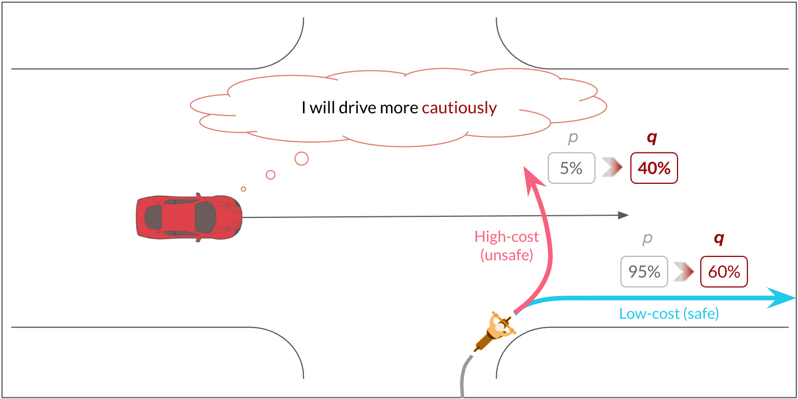

# License statement

The code is provided under a Attribution-NonCommercial 4.0 International (CC BY-NC 4.0) license. Under the license, the code is provided royalty free for non-commercial purposes only. The code may be covered by patents and if you want to use the code for commercial purposes, please contact us for a different license.

# RAP: Risk-Aware Prediction

This is the official code for [RAP: Risk-Aware Prediction for Robust Planning](https://arxiv.org/abs/2210.01368). You can test the results in [our huggingface demo](https://huggingface.co/spaces/TRI-ML/risk_biased_prediction) and see some additional experiments on the [paper website](https://sites.google.com/view/corl-risk/).

We define and train a trajectory forecasting model and bias its prediction towards risk such that it helps a planner to estimate risk by producing the relevant pessimistic trajectory forecasts to consider.

## Datasets
This repository uses two datasets:
 - A didactic simulated environement with a single vehicle at constant velocity and a single pedestrian.
   Two pedestrian behavior are implemented: fast and slow. At each step, pedestrians might walk at their favored speed or at the other speed.
   This produces a distribution of pedestrian trajectories with two modes. The dataset is automatically generated and used. You can change the parameters of the data generation in "config/learning_config.py"
 - The Waymo Open Motion Dataset (WOMD) with complex real scenes.

## Forecasting model
A conditional variational auto-encoder (CVAE) model is used as the base pedestrian trajectory predictor. Its latent space is quantized or gaussian depending on the parameter that you set in the config. It uses either multi-head attention or a modified version of context gating to account for interactions. Depending on the parameters, the trajectory encoder and decoder can be set to MLP, LSTM, or maskedLSTM.

# Usage

## Installation

- (Set up a virtual environment with python>3.7)
- Install the packge with `pip -e install .`

## Setting up the data

### Didactic simulation
 - The dataset is automatically generated and used. You can change the parameters of the data generation in "config/learning_config.py"

### WOMD
 - [Download the Waymo Open Motion Dataset (WOMD)](https://waymo.com/open/)
 - Pre-process it as follows:
   - Sample set: `python scripts/scripts_utils/generate_dataset_waymo.py <data/Waymo>/scenario/validation <data/Waymo>/interactive_veh_type/sample --num_parallel=<16> --debug_size=<1000>`
   - Training set: `python scripts/interaction_utils/generate_dataset_waymo.py <data/Waymo>/scenario/training <data/Waymo>/interactive_veh_type/training --num_parallel=<16>`
   - Validation set: `python scripts/interaction_utils/generate_dataset_waymo.py <data/Waymo>/scenario/validation_interactive <data/Waymo>/interactive_veh_type/validation --num_parallel=<16>`

    Replace the arguments:
   - `<data/Waymo>` with the path where you downloaded WOMD
   - `<16>` with the number of cores you want to use
   - `<1000>` with the number of scene to process for the sample set (some scenes are filtered out so the resulting number of pre-processed scenes might be about the third of the input number)
 - Set up the path to the dataset in "risk_biased/config/paths.py"

## Configuration and training

- Set up the output log path in "risk_biased/config/paths.py"
- You might need to login to wandb with `wandb login <option> <key>...`
- All the parameters defined in "risk_biased/config/learning_config.py" or "risk_biased/config/waymo_config.py" can be overwritten with a command line argument.
- To start from a WandB checkpoint, use the option `--load_from "<wandb id>"`. If you wish to force the usage of the local configuration instead of the checkpoint configuration, add the option `--force_config`. If you want to load the last checkpoint instead of the best one, add the option `--load_last`.

### Didactic simulation
 - Choose the parameters to set in "risk_biased/config/learning_config.py"
 - Start training: `python scripts/train_didactic.py`

### WOMD
 - Choose the parameters to set in "risk_biased/config/waymo_config.py"
 - Start traning: `python scripts/train_interaction.py`

Training has two phases: training the unbiased predictor then training the biased encoder with a frozen predictor model. This second step need to draw many samples to estimate the risk. It is possible that your GPU runs out of memory at this stage. If it does consider reducing the batch size and reducing the number of samples "n_mc_samples_biased". If the number of samples "n_mc_samples_risk" is kept high, the risk estimation will be more accurate but training might be very slow.

## Evaluation

Many evaluation scripts are available in "scripts/eval_scripts", to compute results, plot graphs, draw the didactic experiment scene etc...

You can also run the interactive interface locally with `python scripts/scripts_utils/plotly_interface.py --load_from=<full path to the .ckpt checkpoint file> --cfg_path=<full path to the learning_config.py file  from the checkpoint>`
Sadly the WOMD license does not allow us to provide the pre-trained weights of our model so you will need to train it yourself.
